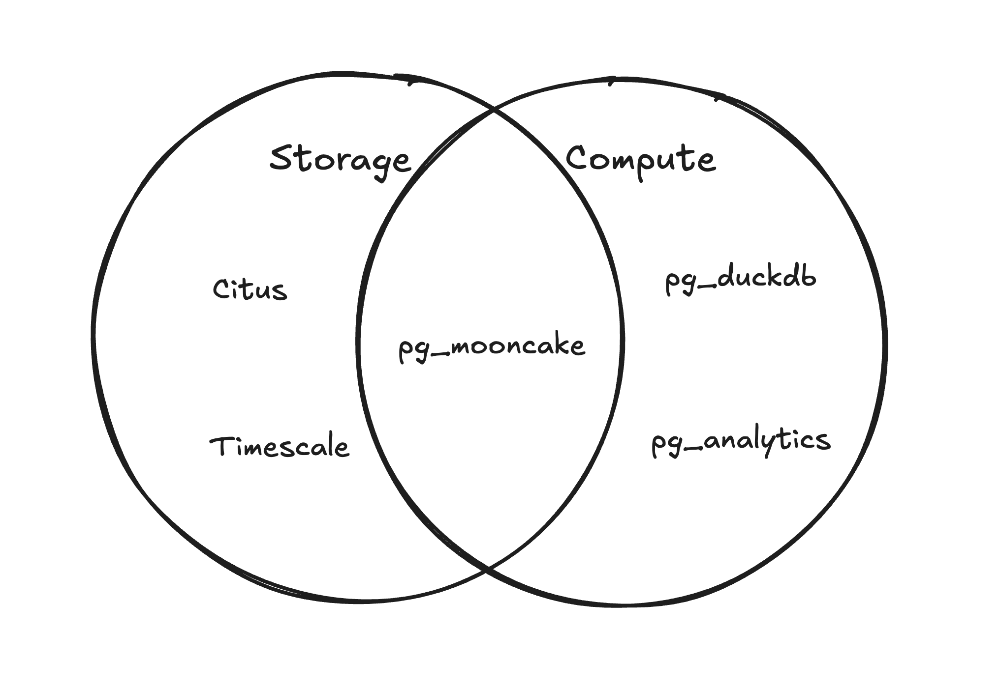

<div align="center">

# pg_mooncake🥮 

 PostgreSQL extension for 1000x faster analytics with columnstore tables and DuckDB execution

[](https://github.com/Mooncake-Labs/pg_mooncake/blob/main/LICENSE)
[](https://join.slack.com/t/mooncakelabs/shared_invite/zt-2sepjh5hv-rb9jUtfYZ9bvbxTCUrsEEA)
[](https://x.com/mooncakelabs)
[](https://pgmooncake.com/docs)

</div>

## Overview

**pg_mooncake** is a PostgreSQL extension that adds a columnar storage format and a vectorized execution engine (DuckDB) for fast analytics in Postgres. 

Columnstore tables are stored as [Iceberg](https://github.com/apache/iceberg) or [Delta Lake](https://github.com/delta-io/delta) tables (Parquet files + metadata) in object storage. The extension is maintained by [Mooncake Labs](https://mooncake.dev/) and is available on [Neon Postgres](https://neon.tech/home).

<div align="center">
  
</div>

## [Installation](https://pgmooncake.com/docs/installation)

### Option 1: Docker

Get started quickly with our Docker image:

```bash
# Pull the image
docker pull mooncakelabs/pg_mooncake

# Run the container
docker run --name mooncake-demo -e POSTGRES_HOST_AUTH_METHOD=trust -d mooncakelabs/pg_mooncake

# Connect using psql
docker run -it --rm --link mooncake-demo:postgres mooncakelabs/pg_mooncake psql -h postgres -U postgres
```

### Option 2: From Source

Build for PostgreSQL versions 14–17:

```bash
git submodule update --init --recursive
make release -j$(nproc)
make install
```

### Option 3: On Neon Postgres

1. [Create a Neon project](https://console.neon.tech/signup)
2. Enable beta extensions:
   ```sql
   SET neon.allow_unstable_extensions='true';
   ```

### Enable the Extension

```sql
CREATE EXTENSION pg_mooncake;
```

## [Quick Start](https://pgmooncake.com/quick-start)

Create a columnstore table:

```sql
CREATE TABLE user_activity(
    user_id BIGINT,
    activity_type TEXT,
    activity_timestamp TIMESTAMP,
    duration INT
) USING columnstore;
```

Insert data:

```sql
INSERT INTO user_activity VALUES
    (1, 'login', '2024-01-01 08:00:00', 120),
    (2, 'page_view', '2024-01-01 08:05:00', 30),
    (3, 'logout', '2024-01-01 08:30:00', 60),
    (4, 'error', '2024-01-01 08:13:00', 60);

SELECT * from user_activity;
```

> Columnstore tables support transactions, updates, deletes, triggers for syncing rowstore and columnstore tables, and ORMs like [Drizzle](https://github.com/drizzle-team/drizzle-orm).

## [Cloud Storage](https://pgmooncake.com/docs/cloud-storage)

Data in columnstore tables is stored in your local file system by default. You can also write data to S3 and R2 buckets.

> **Note**: Neon users need to provide their own S3 bucket. We're working on improving this experience.

## [Load Data](https://pgmooncake.com/docs/load-data)

pg_mooncake supports loading data from:
- PostgreSQL heap tables
- Parquet, CSV, JSON files
- HuggingFace datasets
- Existing Iceberg/Delta tables

## Columnstore Tables as Iceberg/Delta Tables

Find your columnstore table location:

```sql
SELECT * FROM mooncake.columnstore_tables;
```

The directory contains a Delta Lake or Iceberg table that can be queried directly using Pandas, DuckDB, Polars, or Spark.

## Roadmap

| Feature | Status |
|---------|--------|
| Transactional operations (select, insert, copy, updates, deletes) | ✓ |
| Real-time and mini-batch inserts | ✓ |
| Join with regular Postgres tables | ✓ |
| Write Delta Lake format | ✓ |
| Load Parquet files into columnstore tables | ✓ |
| Read existing Iceberg or Delta Lake tables | ✓ |
| Write Iceberg format | Planned |
| Secondary indexes and constraints | Planned |
| Partitioned tables | Planned |

> **Note**: Columnstore tables can handle timeseries workloads without manual partitioning 

## Preview Status

> [!CAUTION]
> **pg_mooncake** is currently in preview and actively under development. For production use inquiries, please reach out on our [Slack community](https://join.slack.com/t/mooncakelabs/shared_invite/zt-2sepjh5hv-rb9jUtfYZ9bvbxTCUrsEEA).
>
> Some functionality may change and key features are still in development.

---

<div align="center">

### Built with love by Mooncake Labs

**pg_mooncake** is the first project from our open-source software studio, Mooncake Labs. We are building modern analytic systems.

[Documentation](https://pgmooncake.com/docs) • [GitHub](https://github.com/Mooncake-Labs/pg_mooncake) • [Slack](https://join.slack.com/t/mooncakelabs/shared_invite/zt-2sepjh5hv-rb9jUtfYZ9bvbxTCUrsEEA)

</div>

## License

This project is licensed under the MIT License. See the [LICENSE](LICENSE) file for details.
